Apparently, chicken prosthetics are a thing I do now. How cool is that?

<em>Una wearing her new leg</em>

Around Christmas 2024, I received an email from a woman named Heather asking if I could design a prosthetic for her chicken, Una. She’d found my [previous post](https://elijahparker000.com/projects/Prosthetic-Chicken-Leg/) about the prosthetic I made for Elizabeth (so at least one person is reading this website!) and wondered if I could do the same for Una. I had some ideas to improve my previous design, so of course I agreed, and off we went!

---

## Making the Mold

We decided to build on what I’d learned making Elizabeth’s prosthetic. Since Heather and Una are in Florida and I’m in Maryland, she started by taking a 3D scan of Una’s nub using her phone and sending it to me. I used that scan to design a 3D-printed mold that would form a custom silicone piece to fit perfectly around Una’s nub.

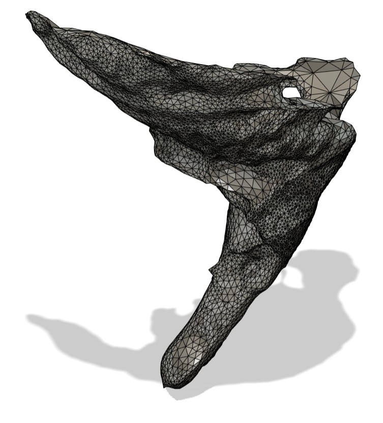

<em>The original scan Heather sent</em>

First, I had to trim away everything in the scan except Una’s actual nub. That left me with a nice, clean model to work from.

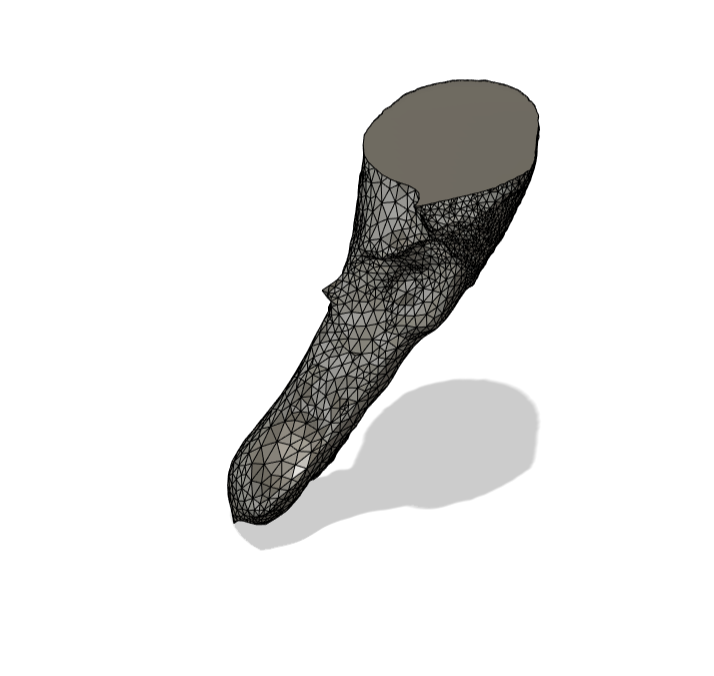

<em>Una’s nub after removing the rest of the original scan</em>

The mold itself has two halves and a series of inserts that correspond to slightly different nub sizes (120%, 110%, 100%, 90%, and 80%, radially), making it possible to experiment with the perfect fit. By swapping out these inserts, Heather can create silicone pieces with different-sized holes for Una’s leg—ensuring the prosthetic stays snug without squeezing too hard. Additionally, the inserts are keyed so that they can only be inserted in the correct orientation, ensuring that the prosthetic is perfectly aligned with Una’s leg.

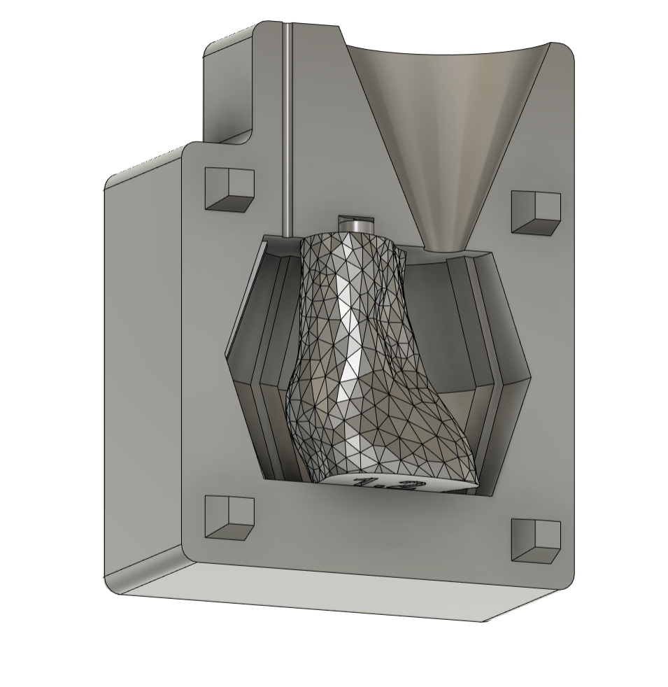

<em>Mold half with insert</em>

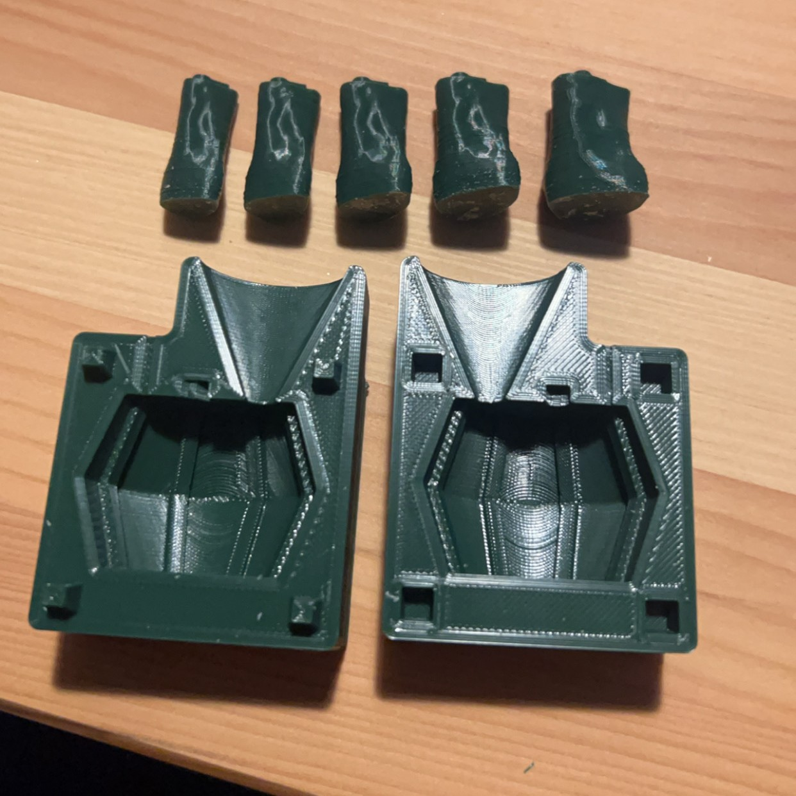

<em>3D mold and five slightly different sized inserts (any insert can be used in the main box)</em>

---

## Casting the Silicone

Once the mold is printed, we pour in silicone to create a cushioned piece that matches Una’s nub exactly. The new design has a convex shape, preventing the silicone from moving up and down in the plastic shell. I also added eight small grooves around the circumference of the silicone which interlock with the plastic shell to keep it from rotating.

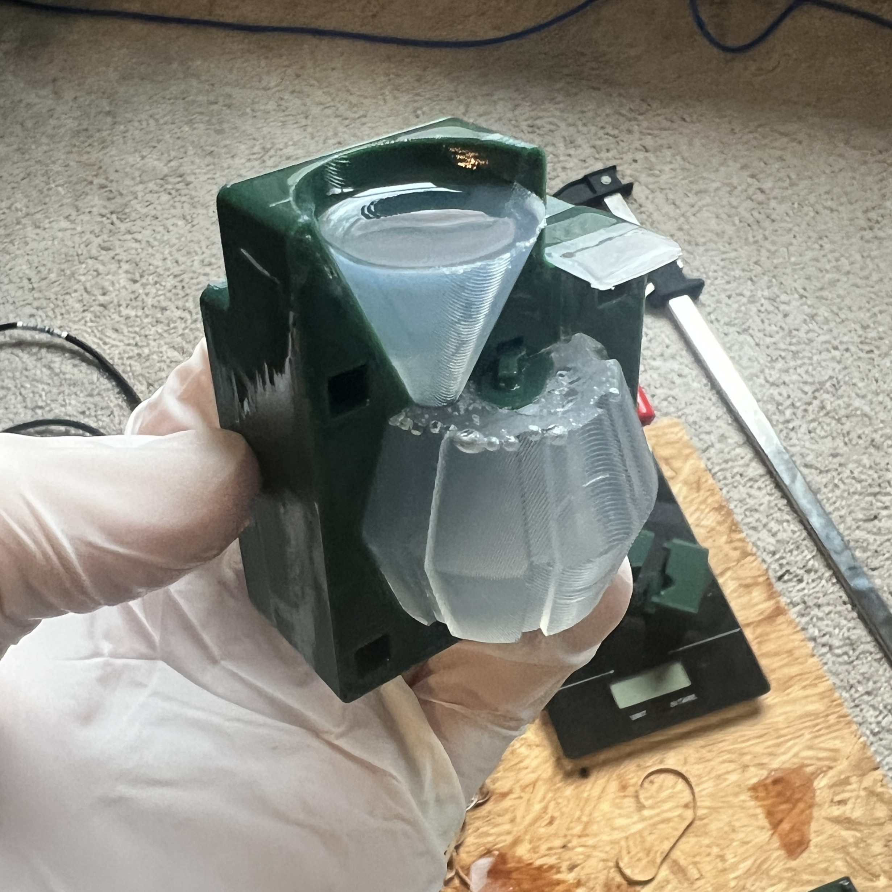

<em>Silicone piece after curing</em>

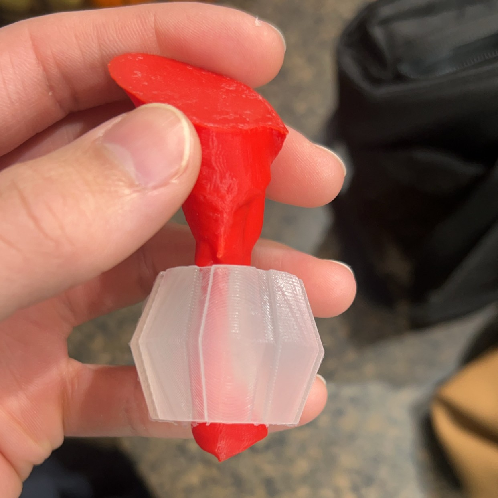

<em>Silicone piece with Una’s nub model inserted</em>

---

## Clamping It All Together

For the plastic piece, I took a new approach: four separate clamp pieces (plus the main leg) that tighten around the silicone using eight M3×20 mm screws and nuts. Tightening them evenly keeps the pressure distributed around Una’s nub and allows Heather to fine tune the tightness for maximum grip without hurting Una.

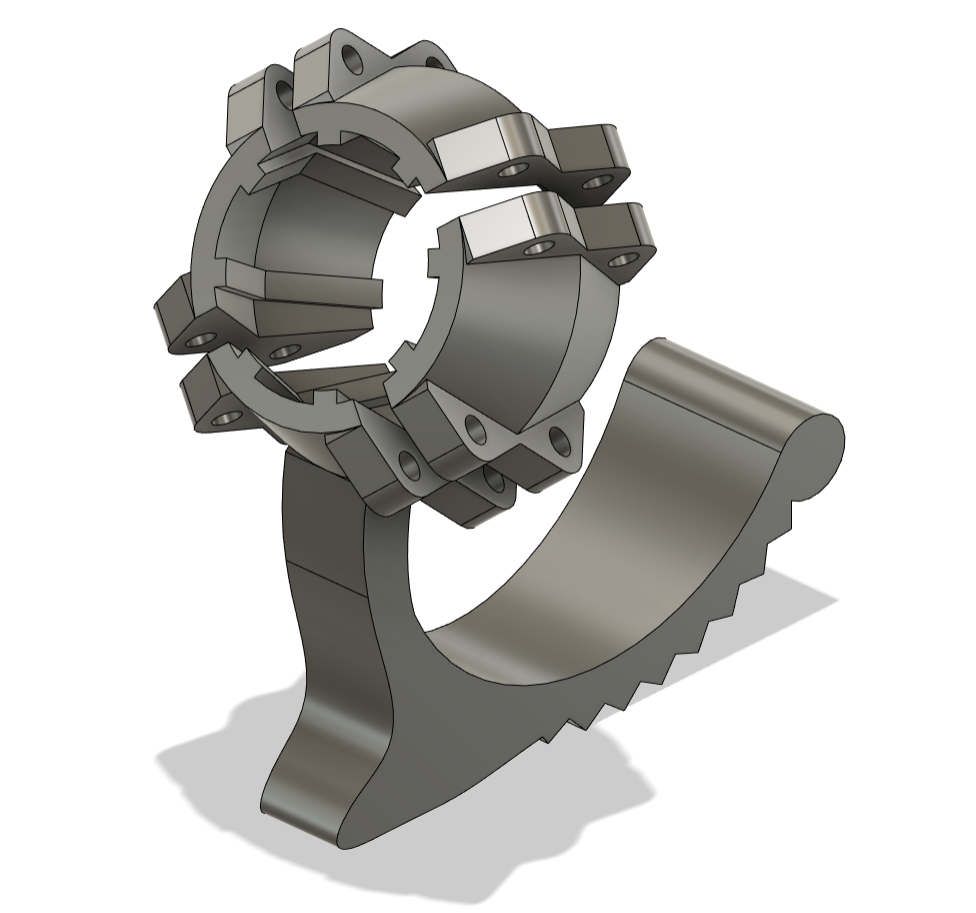

<em>Prosthetic model including clamping pieces</em>

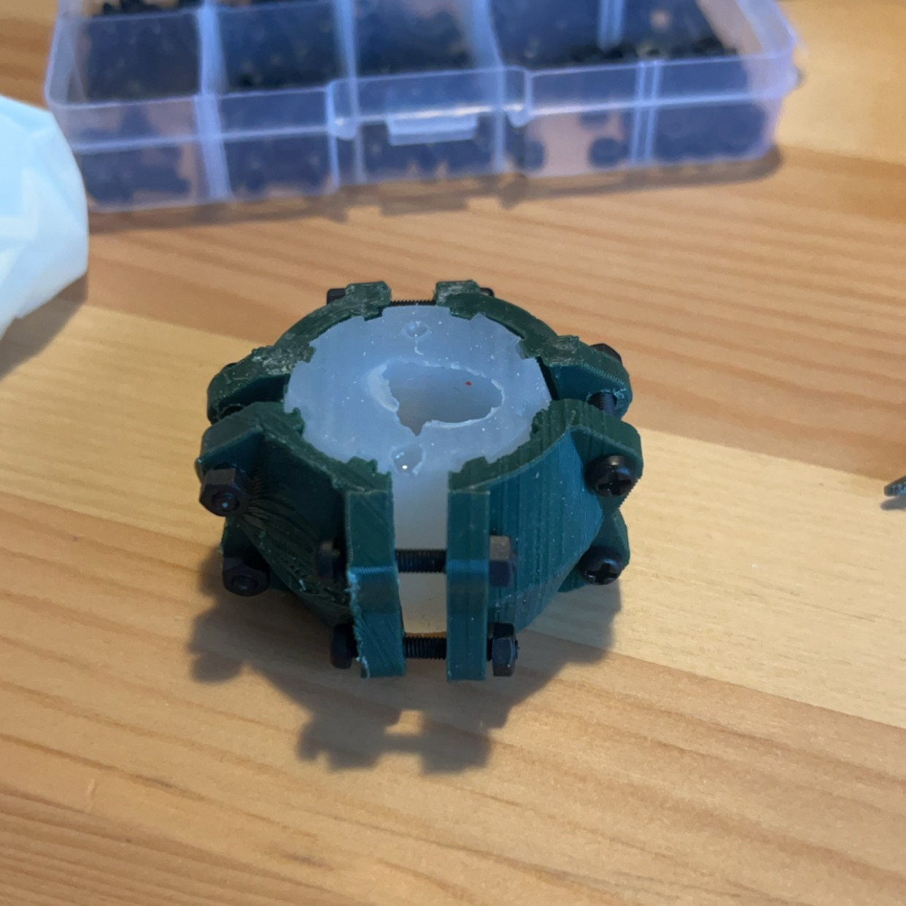

<em>Four identical clamping pieces clamped around the silicone piece</em>

---

## The Final Product

All those tweaks led to something we’re pretty excited about. Three of the clamp pieces are identical, and the fourth is built directly into the main leg structure which has been kept largely unchanged thus far. This means everything lines up perfectly and can be tightened or loosened as needed to find the perfect fit for Una.

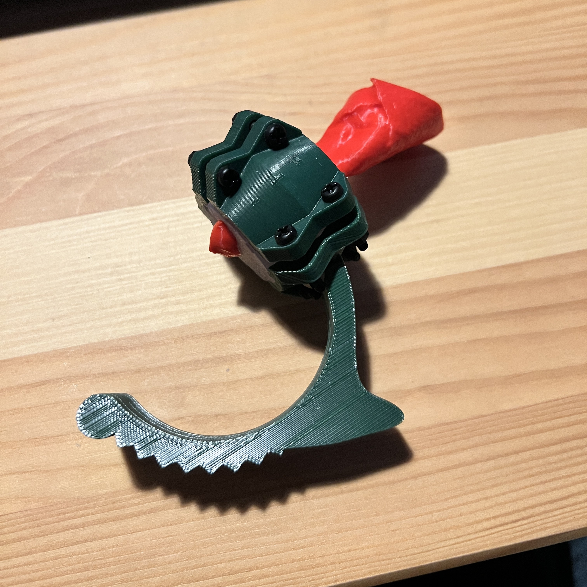

<em>The final product consisting of three identical clamping pieces and the fourth clamping piece which is built into the main leg</em>

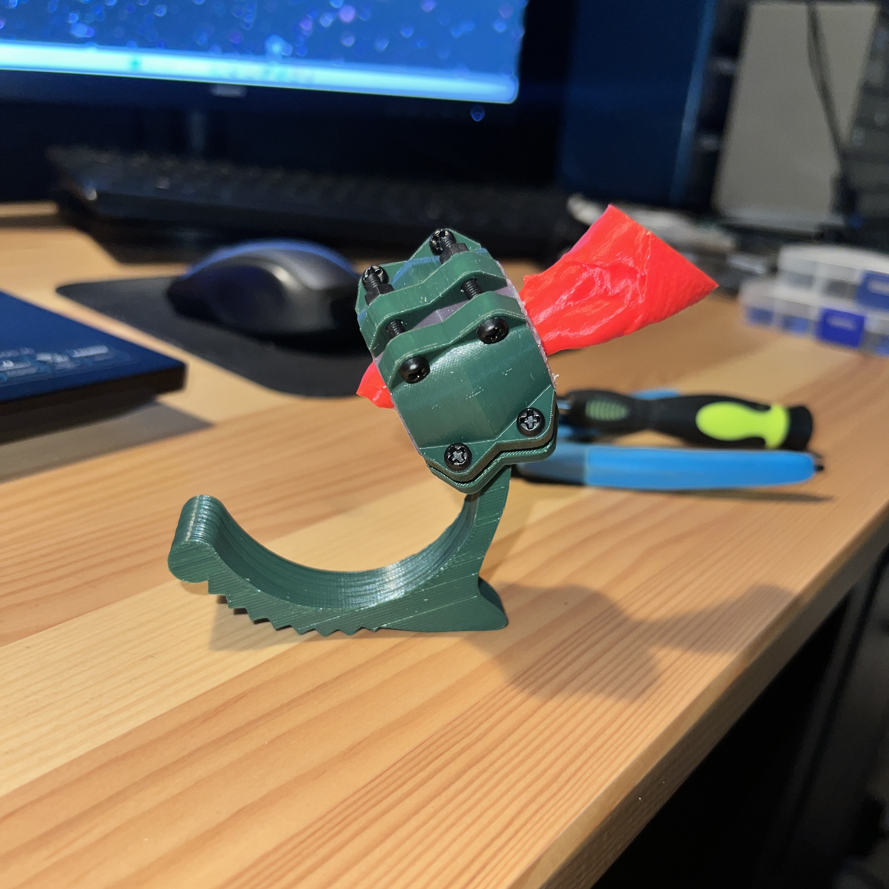

<em>It looks pretty cool, doesn't it?</em>

<video src="/assets/images/una_prosthetic/una_walk_1.mp4" controls></video>
<video src="/assets/images/una_prosthetic/una_walk_2.mp4" controls></video>

<em>She's a little wobbly, but she's got the spirit</em>

So far, I think this design has turned out really well, and I've really enjoyed getting a second crack at this problem. This prosthetic was custom designed for Una, but the files are available for download for free at [this link on Printables](https://www.printables.com/model/1189709-prosthetic-chicken-leg) and [this link on my GitHub](https://github.com/elijahparker000/UnaProstheticChickenLeg). I'll try to keep everything updated as this project continues.

---

## Soapbox

A big part of why I love this project is because of my strong feelings about animal welfare. If you can feel compassion for a single, identifiable chicken with a missing foot, please consider extending that compassion to the more than 70 billion (with a "B") nameless chickens just like her who needlessly suffer and die each year. And please consider extending your compassion to the *trillions* of other animals who are confined, mutilated, exploited, and murdered every year. Everything that you buy, you vote for, and there's no reason to vote for animal abuse.

If you'd like to know more about following a vegan lifestyle, you can find my contact info on this website. I would love to help.

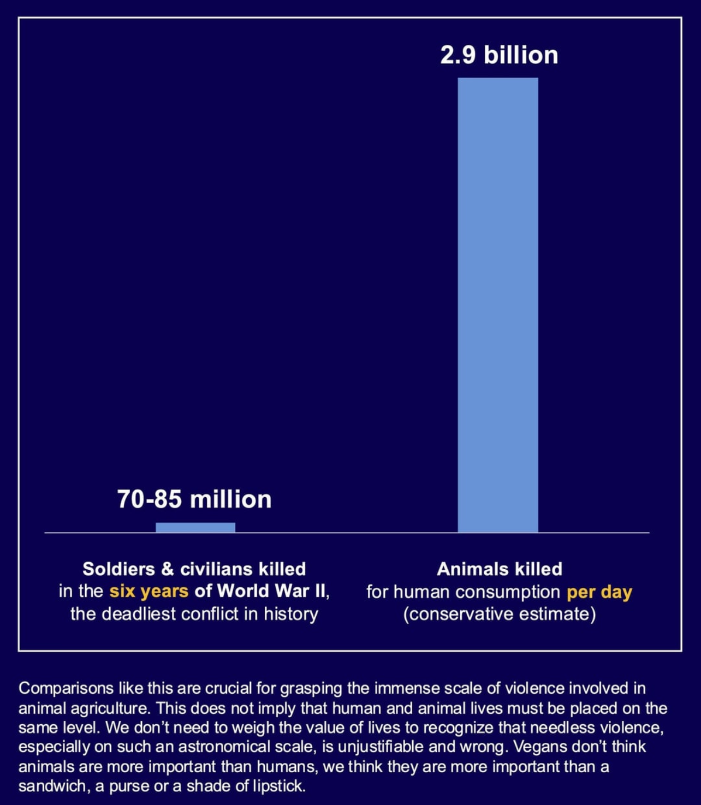